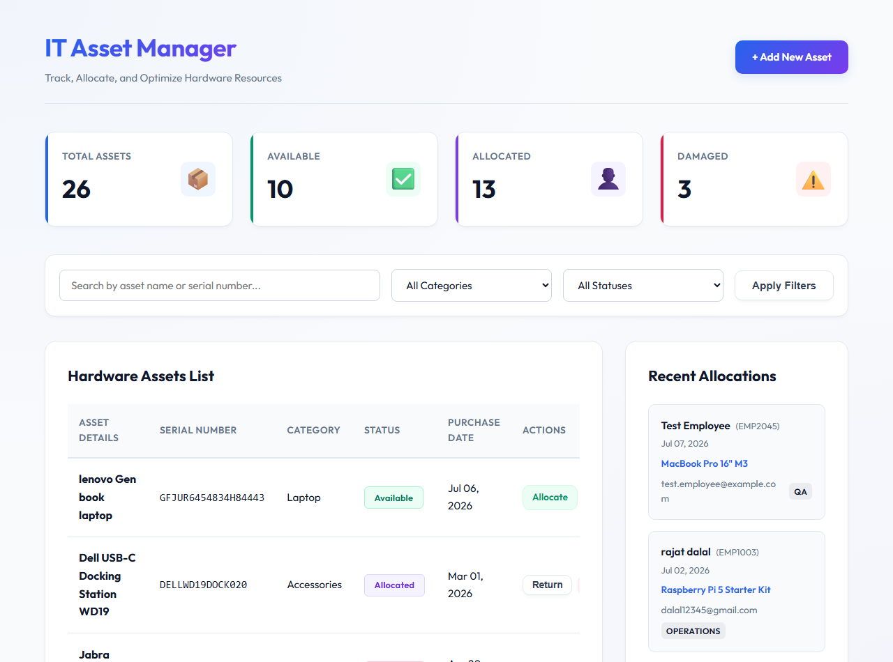
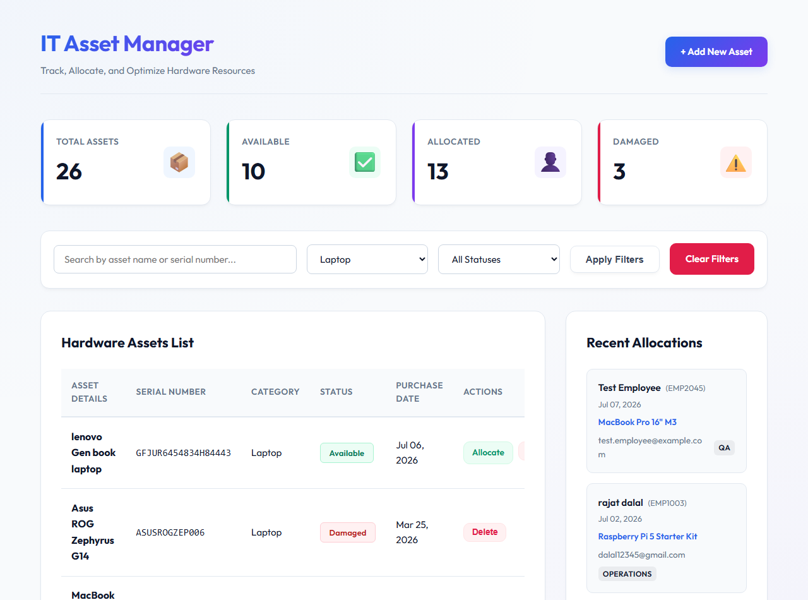
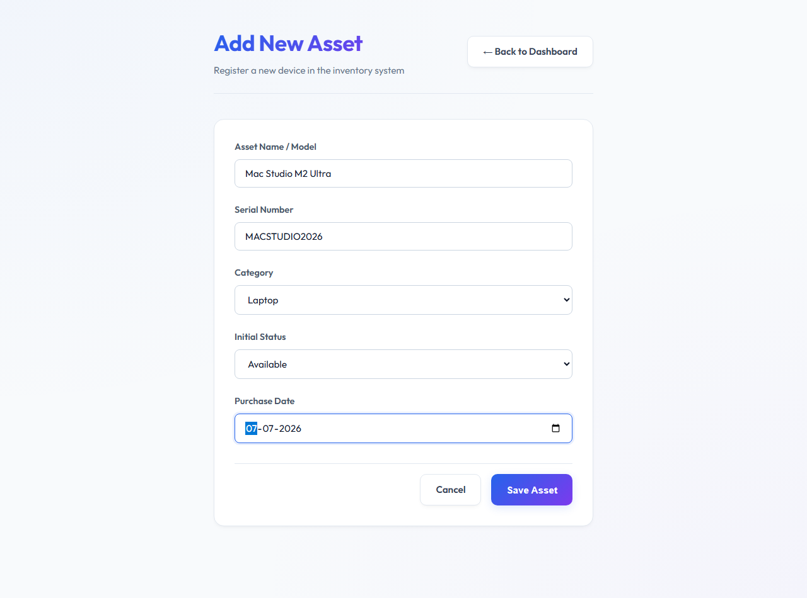
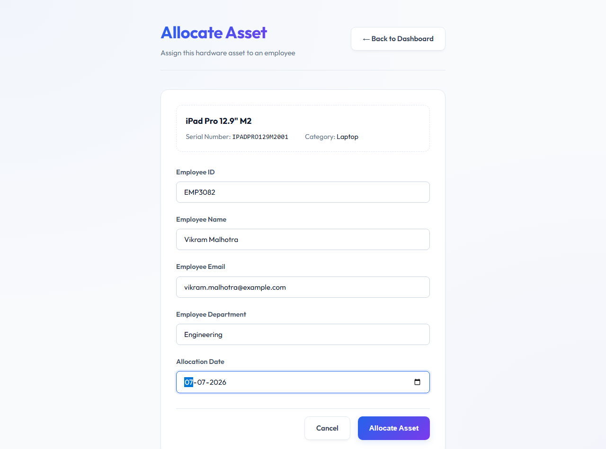
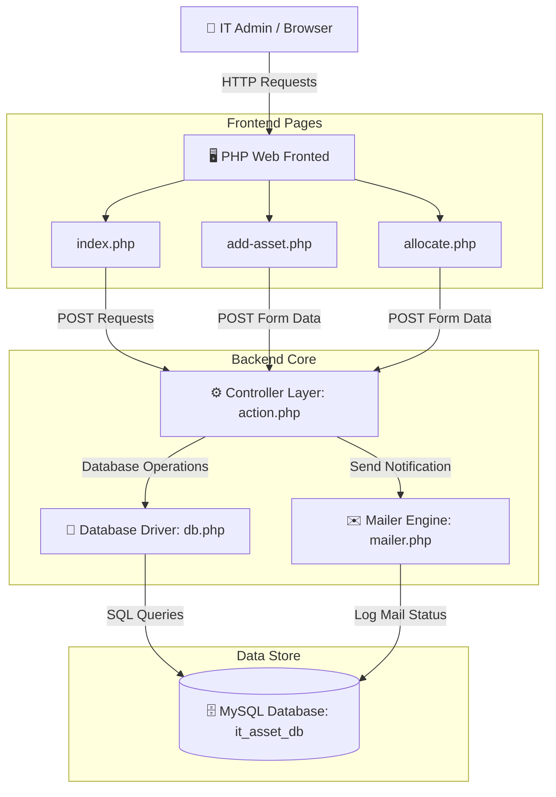
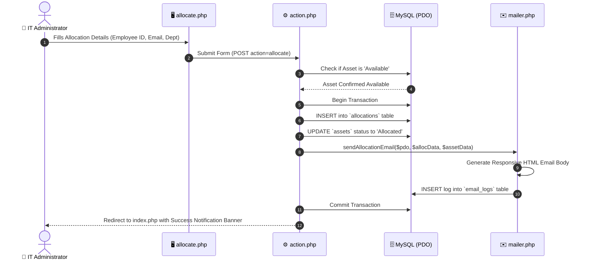
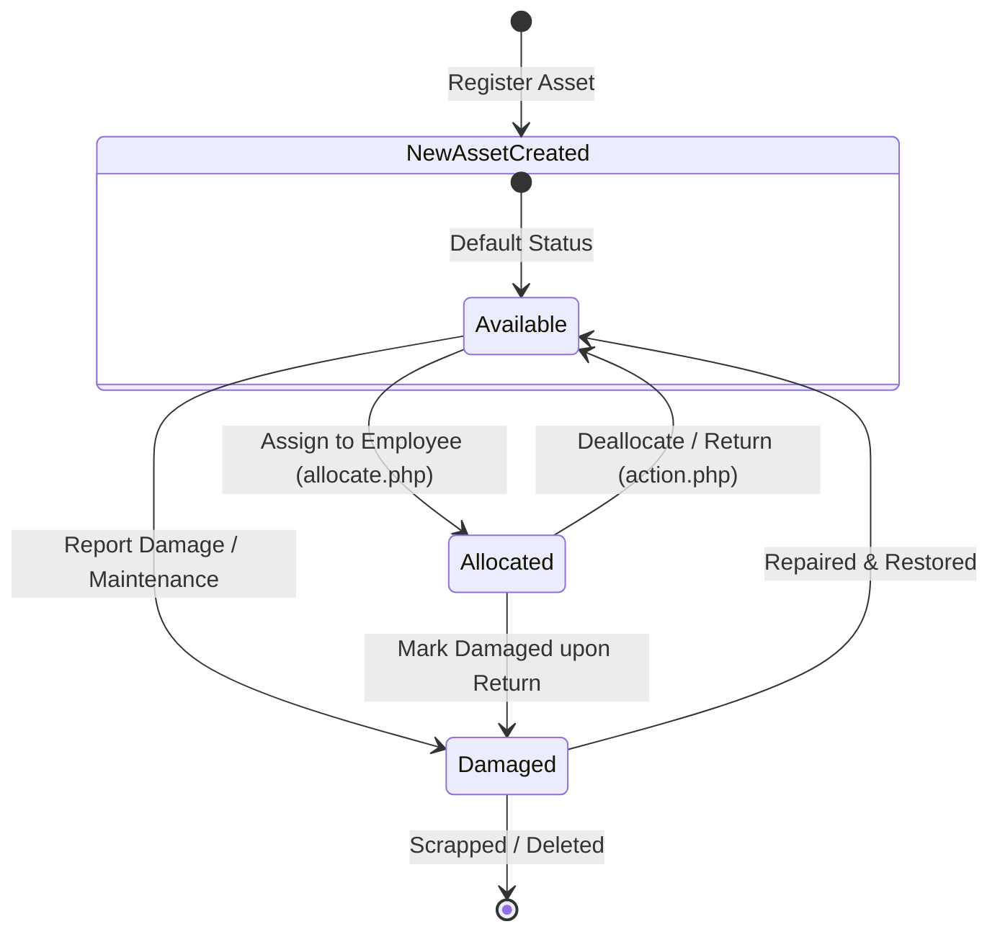
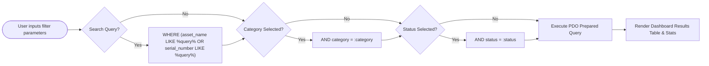
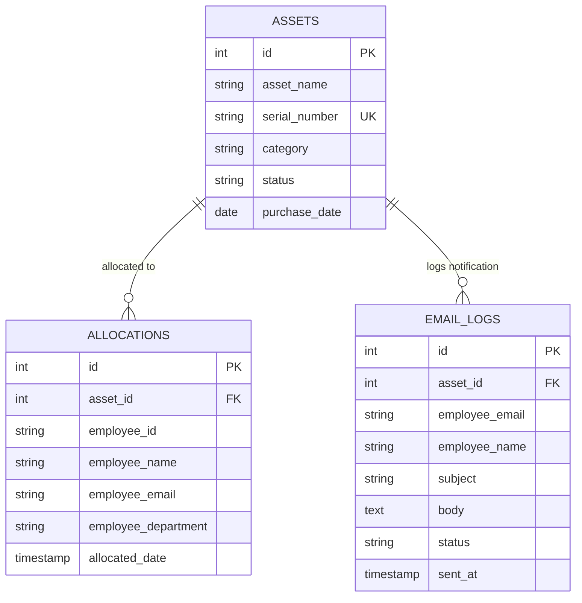

# 💻 IT Asset Management System

[](https://www.php.net/)
[](https://www.mysql.com/)
[](LICENSE)
[](http://makeapullrequest.com)

> A modern, lightweight, and full-featured **IT Asset Management & Hardware Lifecycle Tracking System** built with **PHP (PDO)** and **MySQL**. Track hardware inventory, allocate devices to employees, monitor asset conditions, and trigger automated email notification logs seamlessly.

---

## 📸 Visual Preview & Dashboard Tour

| 📊 Main Analytics Dashboard | 🔍 Real-time Search & Multi-Filters |
| :---: | :---: |
|  |  |

| ➕ Add New Hardware Asset | 🤝 Allocate Asset to Employee |
| :---: | :---: |
|  |  |

---

## ✨ Key Features

- **📦 Inventory Asset Management**: Add, update, view, and soft-delete hardware assets (Laptops, Monitors, IoT Kits, Mobile Devices, Accessories) with unique serial number verification.
- **🔄 Employee Allocation Workflow**: Easily assign hardware to employees with detail tracking (Employee ID, Name, Email, Department, and Date).
- **✉️ Automated Email Notifications & Audit Logging**: Generates HTML notification emails upon allocation and logs all dispatch records into the database.
- **🏷️ Real-time Status Lifecycle**: Tracks asset statuses dynamically (`Available`, `Allocated`, `Damaged`).
- **🎯 Advanced Search & Filtering**: Multi-parameter search by serial number, asset name, category, or operational status.
- **📈 Dashboard KPI Metrics**: Real-time summary statistics cards showing total assets, available devices, allocated count, and damaged units.
- **🛡️ Secure Database Operations**: Powered by PHP PDO with prepared statements to protect against SQL Injection attacks.

---

## 📐 System Architecture & Workflow Diagrams

### 1️⃣ System Component Architecture


---

### 2️⃣ Asset Allocation & Email Notification Sequence


---

### 3️⃣ Asset Lifecycle State Machine


---

### 4️⃣ Search & Multi-Filtering Algorithm


---

## 🗄️ Database Architecture & ER Diagram



---

## 🛠️ Tech Stack & Technologies

* **Frontend**: HTML5, Modern Responsive CSS3 (Glassmorphism & Clean Card Layouts), FontAwesome / SVG Icons.
* **Backend**: PHP 8.x (PDO MySQL Driver, Session Management, Custom Mailer Component).
* **Database**: MySQL / MariaDB (Relational Database with Foreign Key constraints & Cascading deletes).
* **Server Environment**: Apache / Nginx (XAMPP, Laragon, or WampServer compatible).

---

## 🚀 Quick Start & Local Setup

### 1️⃣ Prerequisites
Make sure you have the following installed on your machine:
* [PHP 8.0+](https://www.php.net/downloads)
* [MySQL 8.0+](https://www.mysql.com/) or [MariaDB](https://mariadb.org/)
* A local web server like **XAMPP**, **Laragon**, or **WampServer**

### 2️⃣ Clone the Repository
```bash
git clone https://github.com/your-username/IT-Asset-Management.git
cd IT-Asset-Management
```

### 3️⃣ Setup Database
1. Open **phpMyAdmin** (or your MySQL client like DBeaver / HeidiSQL).
2. Create a database or simply run the provided `schema.sql` script:
```sql
SOURCE path/to/schema.sql;
```
This script creates the database `it_asset_db`, all required tables (`assets`, `allocations`, `email_logs`), and seeds initial mock data.

### 4️⃣ Configure Connection Credentials
Open [`db.php`](db.php) and update your database credentials if necessary:
```php
$host = '127.0.0.1';
$db   = 'it_asset_db';
$user = 'root';
$pass = 'root'; // Set your MySQL password (leave empty '' for default XAMPP setup)
```

### 5️⃣ Run the Application
Place the repository folder in your local web root directory (`htdocs` for XAMPP, `www` for Laragon) and navigate to:
```
http://localhost/IT Asset MAnagement/index.php
```
Or start PHP's built-in web server:
```bash
php -S localhost:8000
```
Then open `http://localhost:8000` in your web browser.

---

## 📂 Project Structure

```
IT Asset Management/
├── 📄 index.php             # Main Dashboard, KPI Cards, Inventory List & Filters
├── 📄 add-asset.php         # Form to register new hardware assets
├── 📄 allocate.php          # Form to assign an asset to an employee
├── 📄 action.php            # Controller handling POST requests (Add, Allocate, Deallocate, Delete)
├── 📄 db.php                # Database PDO connection setup
├── 📄 mailer.php            # Email dispatch helper & audit logging engine
├── 📄 style.css             # Modern custom CSS styling & component designs
├── 📄 schema.sql            # Database schema & sample seed data
└── 🖼️ *.png                # Preview screenshots for documentation
```

---

## 💻 How to Use

1. **View Overview Stats**: Check inventory health at a glance from the top metric cards on the main dashboard.
2. **Add New Hardware**: Click **"+ Add New Asset"**, enter the hardware details (Name, Serial Number, Category, Purchase Date), and submit.
3. **Allocate Device**: Click the **"Allocate"** button next to any *Available* asset. Enter the employee's details. The asset status will immediately shift to `Allocated`, an email notification will be logged, and recent allocations will update.
4. **Deallocate / Return**: Click **"Deallocate"** on an allocated item to mark it back as `Available` for reissue.
5. **Search & Filter**: Use the top filter bar to instantly locate specific devices by category, status, or search query.

---

## 🔮 Future Enhancements (Roadmap)

- [ ] 📄 PDF Receipt generation for signed physical hardware handovers.
- [ ] 🏷️ QR Code / Barcode generation for physical asset tagging.
- [ ] 🔒 User Authentication & Role-Based Access Control (Admin / Auditor).
- [ ] 📊 CSV / Excel Data Export for asset reports.
- [ ] 📧 Integration with PHPMailer / SMTP service for live production email delivery.

---

## 📄 License

This project is licensed under the [MIT License](LICENSE) - feel free to modify and use it for personal or commercial projects.

---

### ⭐ Show Your Support
If you found this project helpful, please give it a **Star** on GitHub! 🌟
