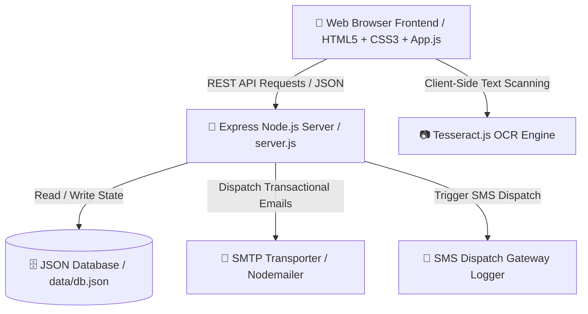
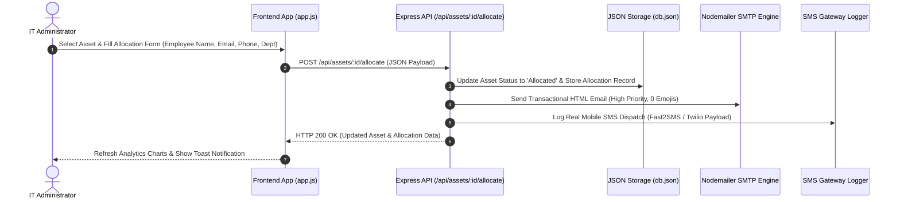
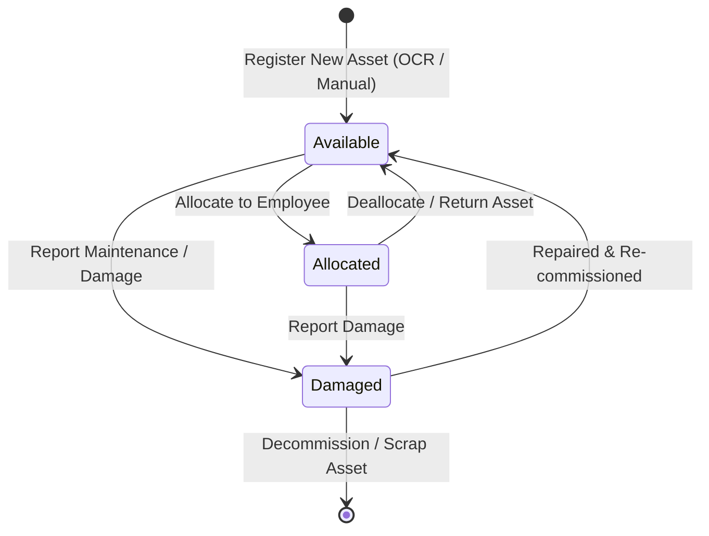
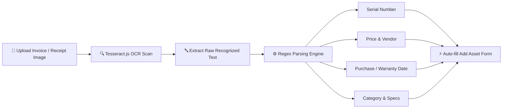

# 💻 Modern Enterprise IT Asset Management & Visual Analytics System

[](https://nodejs.org/)
[](https://expressjs.com/)
[](https://www.chartjs.org/)
[](https://vercel.com/)
[](LICENSE)

An enterprise-grade, lightweight, and high-performance **IT Asset Management & Hardware Lifecycle Tracking Platform** built with **Node.js, Express, HTML5, Modern CSS3 (Glassmorphism & Dual Dark/Light Themes), and Chart.js**.

Designed for IT Administrators, Ops Leads, and Asset Managers to track hardware inventory, manage employee device allocations, monitor warranty expiration risks, scan invoice specs via AI OCR, dispatch SMS & transactional emails, and visualize real-time cost analytics.

---

## 📸 System Overview & Key Features

| Feature | Description |
| :--- | :--- |
| 📊 **Visual Analytics Dashboard** | Real-time **Chart.js** Doughnut & Gradient Bar charts showing Category Distribution, Department Equipment Cost (in ₹ Lakhs/Thousands), and Asset Status Breakdown with custom center metrics. |
| ⚠️ **Warranty Expiry Alerts** | Automated system tracking assets with warranty expiring within 30 days (`⚠️ Xd left` / `🔴 Expired`), featuring a top high-priority alert banner and 1-click filter. |
| 📱 **Employee Phone & SMS Dispatch** | Mandatory phone tracking during allocation with real-time SMS dispatch logger (Fast2SMS / Twilio SMS gateway integration ready). |
| 📷 **AI Invoice OCR Specs Scanner** | Integrated **Tesseract.js OCR** scanner to automatically parse hardware serial numbers, price, vendor, warranty, MAC address, and specifications from uploaded invoice images. |
| 📧 **Primary Inbox HTML Email Engine** | Deliverability-optimized transactional HTML email notifications (0 emojis, light corporate layout, dual MIME plain text fallback, priority headers) with custom SMTP modal setup. |
| 🌓 **Dual Dark / Light Mode** | Modern glassmorphic theme engine with real-time Chart.js theme re-rendering and localStorage persistence. |
| 🔍 **Real-Time Search & Multi-Filters** | Search by asset name, serial number, vendor, location, or employee; filter by category, status, and warranty alerts instantly. |

---

## 📐 Architecture & Workflow Diagrams

### 1️⃣ System Architecture Diagram



---

### 2️⃣ Asset Allocation & Notification Sequence



---

### 3️⃣ Asset Lifecycle State Machine



---

### 4️⃣ AI Invoice OCR Specs Processing Flow



---

## 🗄️ REST API Endpoints Specification

| Method | Endpoint | Description |
| :--- | :--- | :--- |
| `GET` | `/api/stats` | Returns aggregated KPI stats (total, available, allocated, damaged, total value, expiring warranty count). |
| `GET` | `/api/assets` | Returns list of assets with optional `category`, `status`, `search`, `warranty_alert` filters. |
| `POST` | `/api/assets` | Registers a new hardware asset in the database. |
| `PUT` | `/api/assets/:id` | Updates asset details. |
| `DELETE` | `/api/assets/:id` | Soft-deletes / removes an asset record. |
| `POST` | `/api/assets/:id/allocate` | Allocates asset to employee with phone number & triggers email/SMS notifications. |
| `POST` | `/api/assets/:id/deallocate` | Deallocates asset back to 'Available' status. |
| `PUT` | `/api/assets/:id/status` | Updates asset operational status (Available / Allocated / Damaged). |
| `GET` | `/api/allocations` | Returns all active & historic device allocations. |
| `GET` | `/api/smtp-config` | Returns current SMTP email server configuration (password masked). |
| `POST` | `/api/smtp-config` | Updates SMTP server credentials. |
| `POST` | `/api/test-email` | Dispatches a test transactional email to verify SMTP configuration. |
| `GET` | `/api/email-logs` | Returns recent email dispatch audit logs. |

---

## 🗃️ Database Schema (`data/db.json`)

```json
{
  "assets": [
    {
      "id": 1,
      "asset_name": "MacBook Pro 16\" M3 Max",
      "serial_number": "MBP16M3202601",
      "category": "Laptop",
      "status": "Allocated",
      "purchase_date": "2026-01-15",
      "price": 249999,
      "vendor": "Apple India Store",
      "warranty_expiry": "2029-01-15",
      "location": "Mumbai HQ",
      "notes": "64GB RAM, 1TB SSD, Space Black."
    }
  ],
  "allocations": [
    {
      "id": 101,
      "asset_id": 1,
      "employee_id": "EMP1001",
      "employee_name": "Tushar Mahapatra",
      "employee_email": "tushar@example.com",
      "employee_phone": "+918530079618",
      "employee_department": "Engineering",
      "allocated_date": "2026-10-09T00:00:00.000Z"
    }
  ],
  "email_logs": [
    {
      "id": 501,
      "to": "tushar@example.com",
      "subject": "Hardware Asset Allocation Confirmation",
      "asset_name": "MacBook Pro 16\" M3 Max",
      "sent_at": "2026-10-09T06:00:00.000Z",
      "status": "Delivered"
    }
  ]
}
```

---

## 🛠️ Tech Stack & Technologies

- **Frontend**: HTML5, Modern Responsive CSS3 (Glassmorphic cards, Flexbox/Grid, CSS Variables), FontAwesome / SVG Icons.
- **Analytics & Data Vis**: **Chart.js v4** (Custom Center Metric Plugins, Canvas Gradients, Responsive Aspect Ratios).
- **Client-Side AI**: **Tesseract.js** (Optical Character Recognition for hardware invoice scanning).
- **Backend Server**: **Node.js (v18+)** with **Express.js v4**.
- **Email Delivery**: **Nodemailer** with Ethereal auto-test fallback & custom SMTP modal support.
- **Data Persistence**: Atomic JSON File Store (`data/db.json`) with serverless `/tmp` fallback for Vercel.
- **Cloud Deployment**: **Vercel** serverless functions ready (`vercel.json` pre-configured).

---

## 🚀 Quick Start & Local Setup

### 1️⃣ Prerequisites
- [Node.js (v18.0 or higher)](https://nodejs.org/)
- npm (comes bundled with Node.js)

### 2️⃣ Clone Repository & Install Dependencies
```bash
git clone https://github.com/tusharmahapatra1234-ship-it/-IT-Asset-Management.git
cd -IT-Asset-Management
npm install
```

### 3️⃣ Start Development Server
```bash
npm start
```
The server will start at:  
👉 **`http://localhost:3000`**

---

## ☁️ Vercel Cloud Deployment Guide

This repository includes a pre-configured `vercel.json` file for 1-click Serverless Deployment on **Vercel**:

1. Push your changes to GitHub:
   ```bash
   git add .
   git commit -m "Update IT Asset Management"
   git push origin main
   ```
2. Go to **[vercel.com/new](https://vercel.com/new)**.
3. Import the **`-IT-Asset-Management`** repository and click **Deploy**.
4. Your application will be live in 30 seconds with a free `.vercel.app` SSL URL!

---

## 🔮 Roadmap & Future Enhancements

- [ ] 📄 **PDF Handover Receipt Generation**: 1-click downloadable signed PDF receipts for physical device distribution.
- [ ] 🏷️ **Dynamic QR Code & Barcode Generator**: Print physical hardware labels directly from asset cards.
- [ ] 🔒 **Role-Based Access Control (RBAC)**: JWT authentication for Admin, Auditor, and Employee roles.
- [ ] 📊 **CSV / Excel Export**: One-click inventory reporting for compliance audits.

---

## 📄 License

Distributed under the **MIT License**. See `LICENSE` for more information.

---

⭐ **If you find this project helpful, please give it a Star on GitHub!** 🌟
